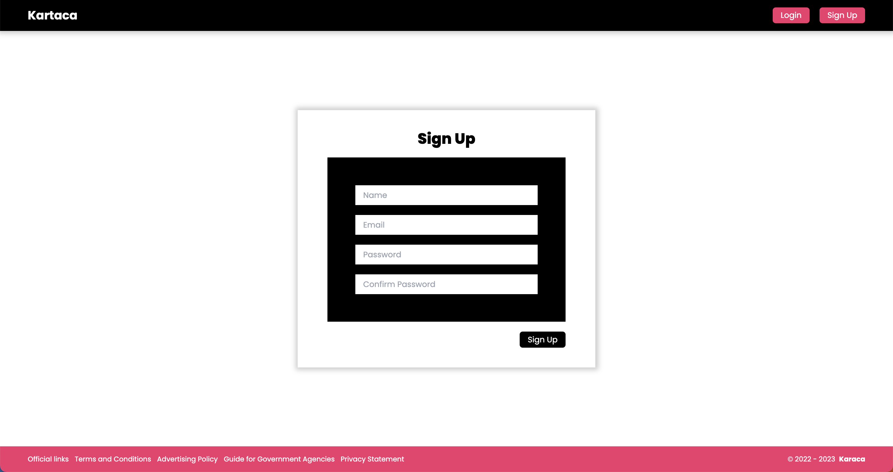
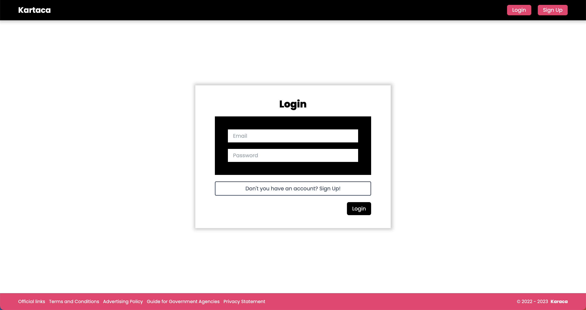
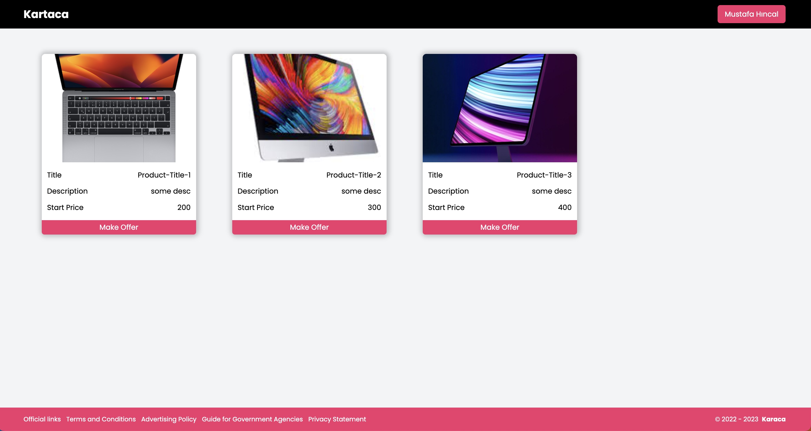
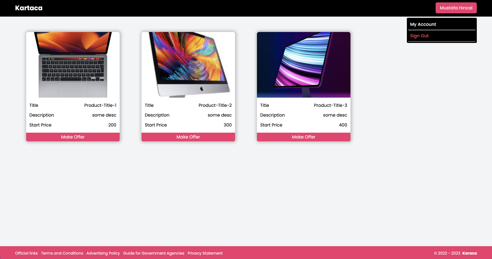
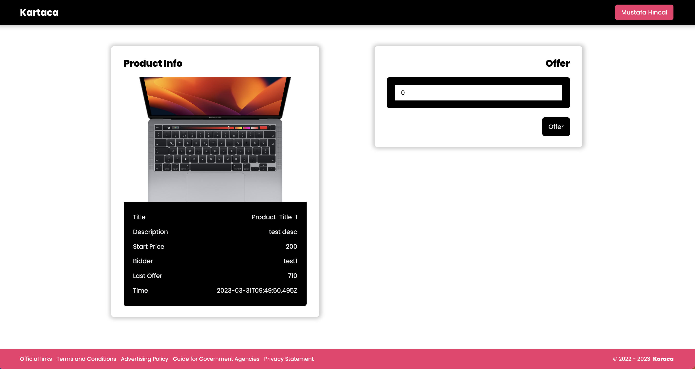
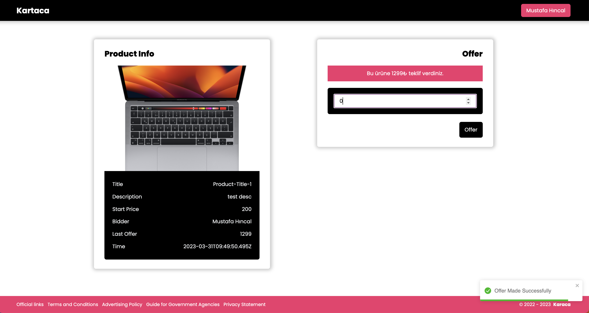
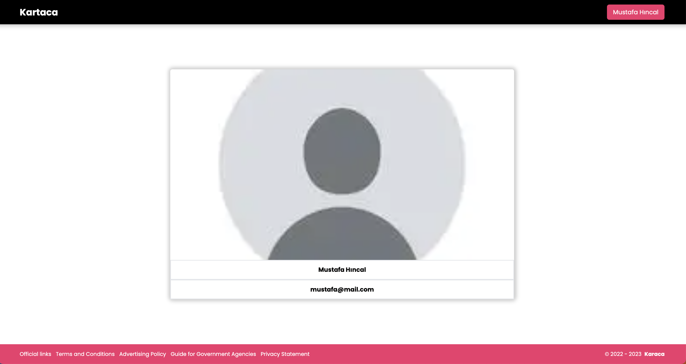

# Kartaca Task

## **Project Description (Proje Açıklaması)**

- The user can be registered and logged in from the member registration screen. (Kullanıcı üye kayıt ekranından kayıt olunup, giriş yapılabilir.)
- Logged in users will see 3 products on the home page. (Oturum açan kullanıcılar ana sayfa üzerinde 3 adet ürün görecektir.)
- Products can be offered live. (Ürünlere canlı olarak teklif verilebilir.)
- User can see another user's offer without refreshing the page. (Kullanıcı bir başka kullanıcın yaptığı teklifi sayfa yenilemeden görebilir)

## **Registration Key**

_43aa19c7c2dde5de2dcb486d18a1ae31a53bed49ff1f916cac100e1ea06054cc_

## **Technologies used in the project (Projede kullanılan teknolojiler)**

### **Frontend**

- **Next.js - Typescript**
- **Tailwind**
- **Socket.io-Client**
- **Axios**
- **Context API**
- **Toastify**
- **Yup**

### **Backend**

- **Node.js - Typescript**
- **Express.js**
- **Redis**
- **Socket.io**
- **Mongoose**
- **Bcrypt**

### **Database**

- **Mongo DB**

## **Run the Project (Projeyi çalıştır)**

Clone the project

```bash
  git clone https://github.com/mustafahincal/kartaca-task.git
```

Go to the project directory

```bash
  cd kartaca-task
```

Lets Docker up

```bash
  docker-compose up
```

You will see the project running on localhost:3000. Ports;

```bash
  client => 3000
  server => 4000
  mongodb => 27017
  redis => 6379
```

## **Features**

### Authenticaton




### Products Page




### Product and Offer Page




### Profile



## **Made By**

[Mustafa Hıncal](https://github.com/mustafahincal)
